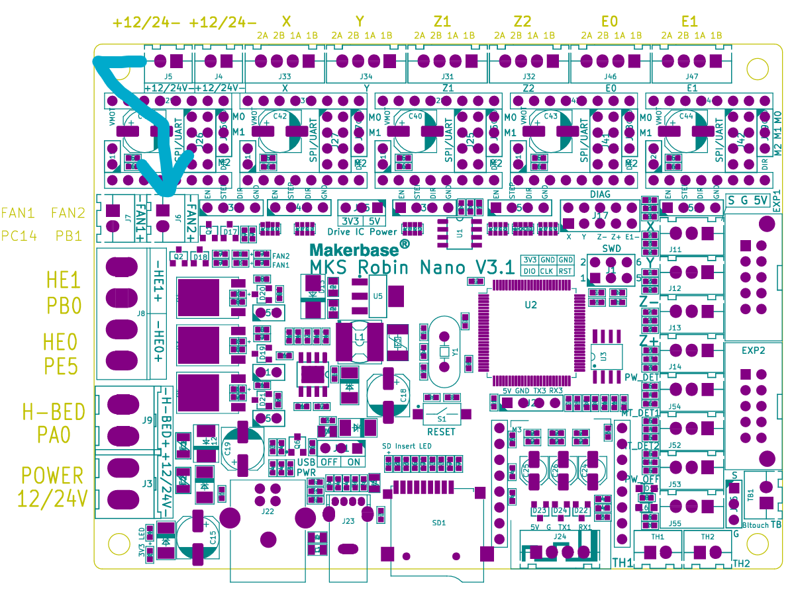

# Klipper Settings

The [printer.cfg](printer.cfg) is based on the stock SP-5 V3 motherboard, Makerbase Robin Nano v3.1

If you want to use the [macros](SP-5_V3_macro.cfg) for start/end, replace the existing start and end G-code with the following. The START_PRINT macro assumes you have a mesh named default. (Works in Cura, ymmv.)
Start G-code:
```
START_PRINT BED_TEMP={material_bed_temperature_layer_0} EXTRUDER_TEMP={material_print_temperature_layer_0}
```
End G-code:
```
END_PRINT
```

I moved my heatsync fan to J6 so it can be turned on/off as needed instead of always running. The printer.cfg file is set up for this, but it's optional to move the fan since J5 is always on. Do what you want, I'm not your dad. A word of warning, if you move the wrong plug then the case fans won't run all the time like they are durrently set to so be sure you know which plug is case fans and which is hot end cooler.


