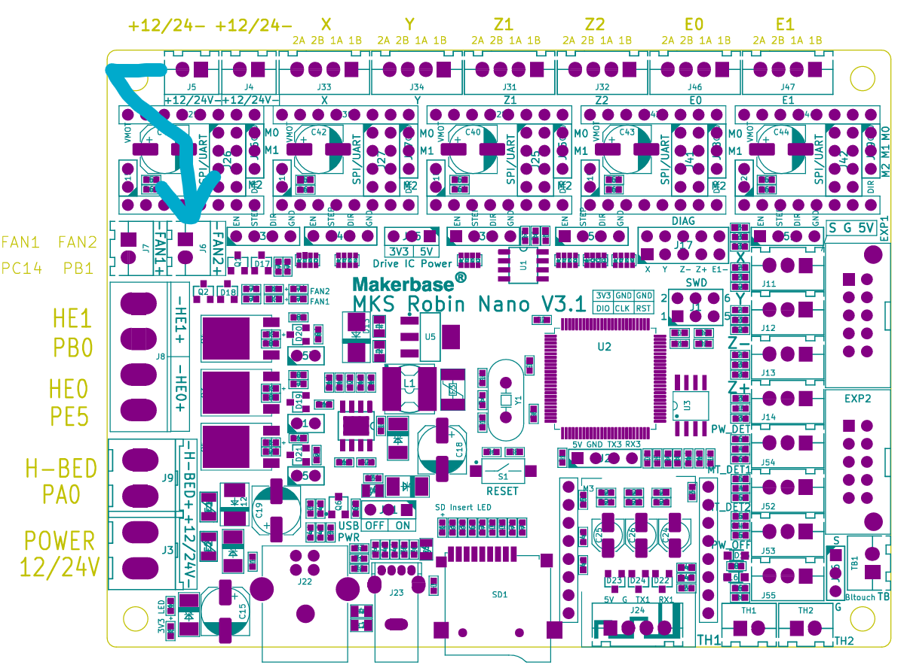

# Klipper Settings

If you want to use the macros for start/end, add this to your slicer config:
Start G-code:
```
START_PRINT BED_TEMP={material_bed_temperature_layer_0} EXTRUDER_TEMP={material_print_temperature_layer_0}
```
End G-code:
```
#END_PRINT
```

I moved my heatsync fan to J6 so it can be turned on/off as needed instead of always running. The printer.cfg file is set up for this, but it's optional to move the fan since J5 is always on. Do what you want, I'm not your dad.


