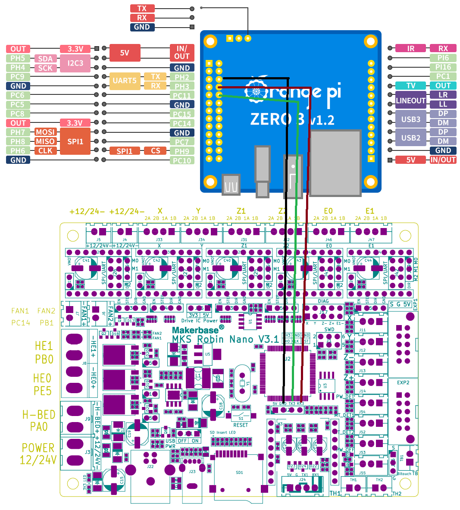

# Orange Pi Zero 3

This directory contains information on utilizing the Orange PI Zero 3 1.5G to run Klipper. Including the files to print a case for the board will replace the printers electronics cover. The case allows for access to the Orange PI's I/O through an enclsure built around the SP-5 V3 frame. You could probably just put whatever flavor of Pi you want under the deck with the rest of the electronics. Do what you want, I'm not youre dad.

I am using a UART connection between Orange Pi Zero 3 and the Robin Nano v3.1. UART setup on the Pi can be found [here on the Orange Pi Wiki](http://www.orangepi.org/orangepiwiki/index.php/Orange_Pi_Zero_3#26pin_UART_test). Pin connections depicted below, be sure to conenct Tx to Rx and Rx to Tx. Or just use USB if you want; I'm not your dad. But USB won't work with the case.

|Orange Pi Pin |Function | Function | Rodin Nano Pin|
|:---|:---|---:|---:|
|6|GND|GND|J2 Header - 2|
|8|TX|RX|J2 Header - 4|
|10|RX|TX|J2 Header - 3|

