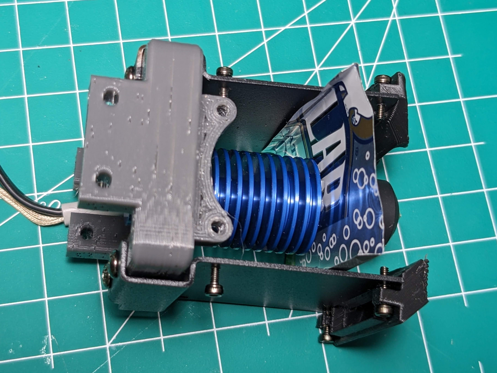
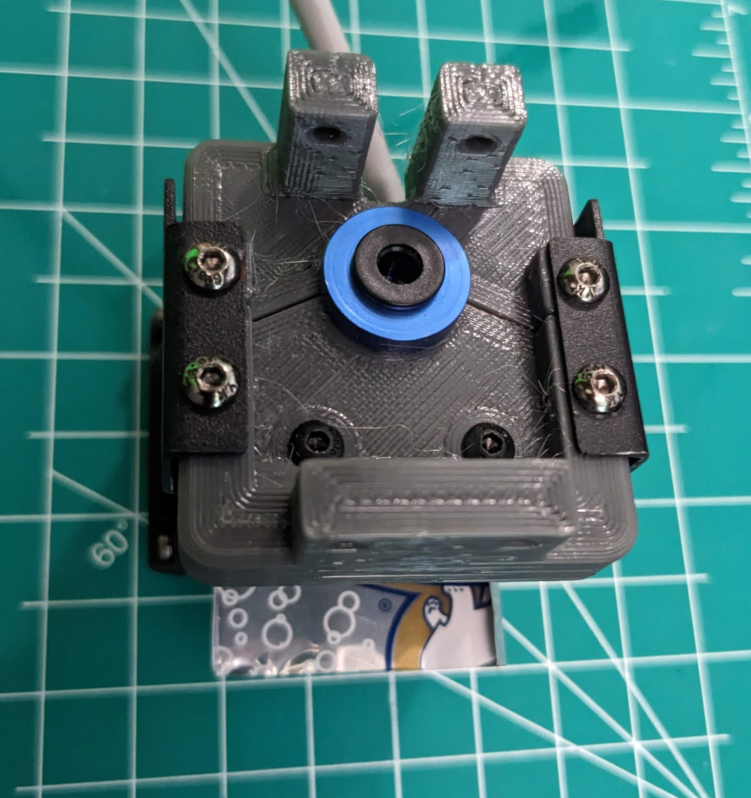
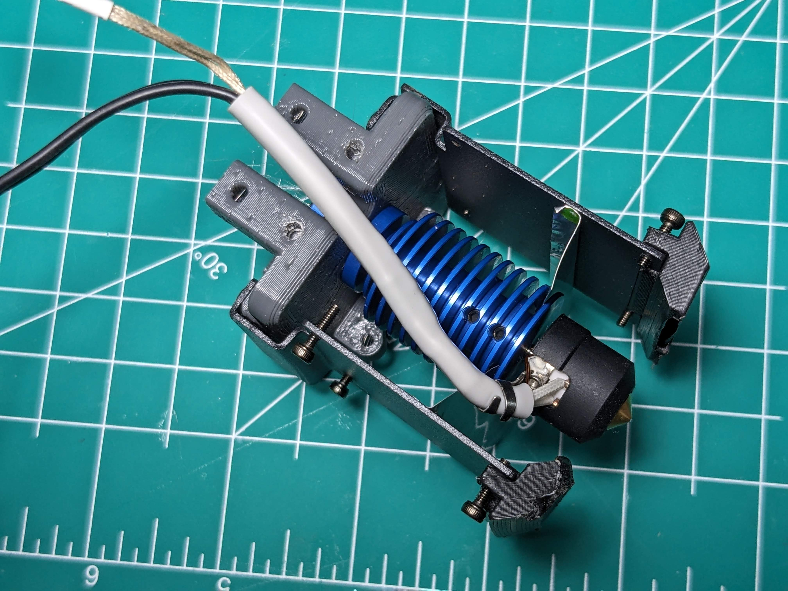
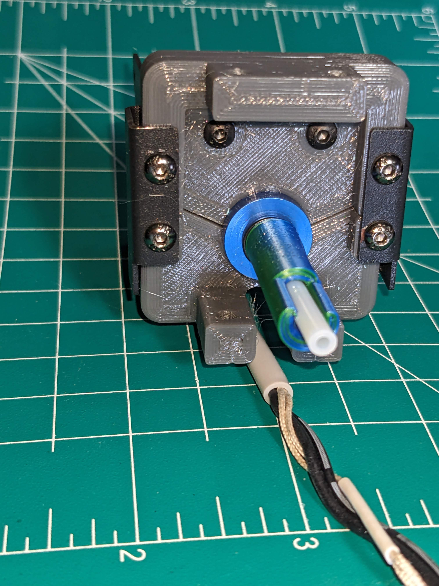
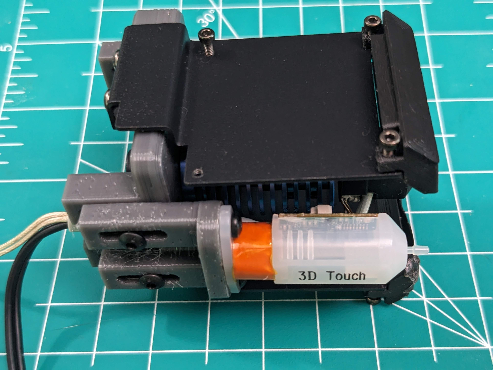
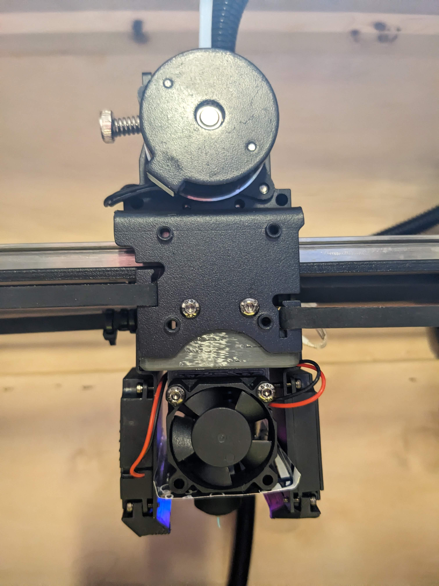
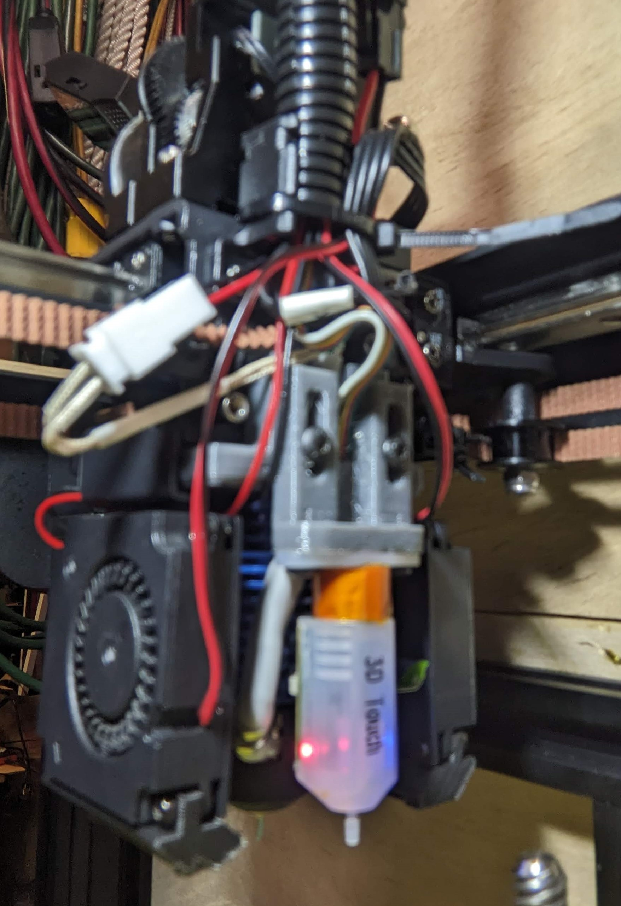
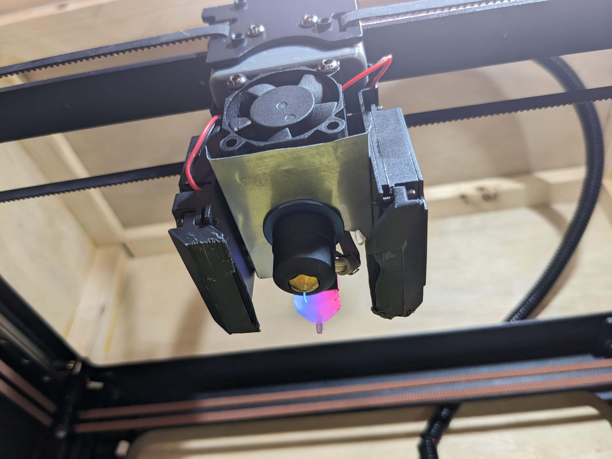
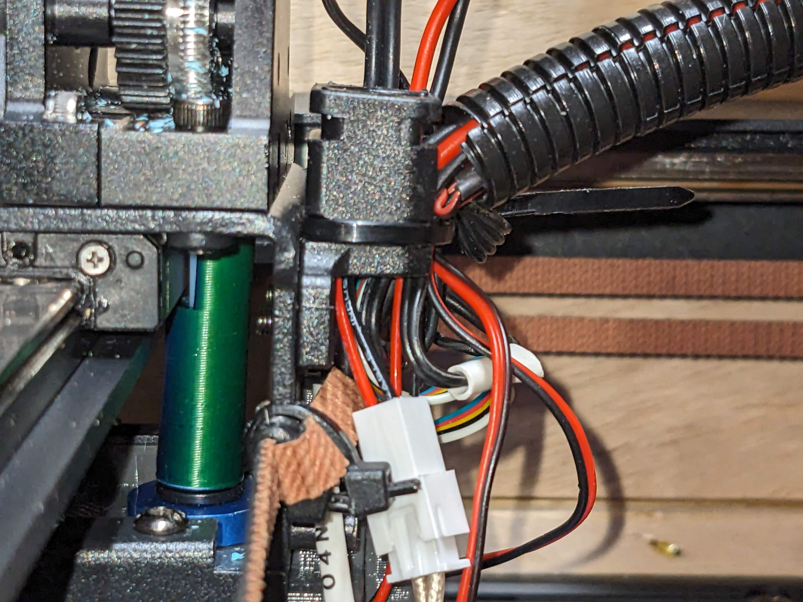
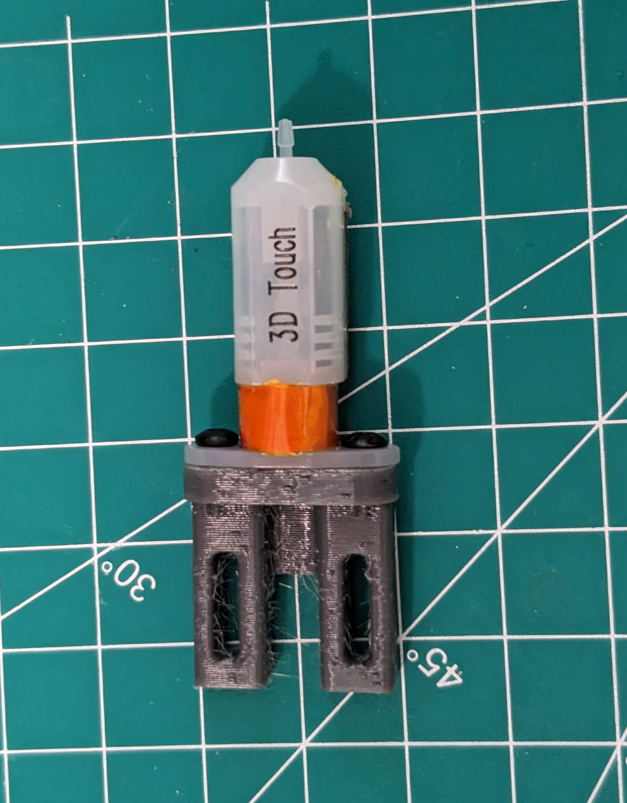

# V6 (style) Hotend Bracket

I came across an old [YouTube from ModBot](https://www.youtube.com/watch?v=cXx1_OsDcIc) where he put an E3Dv6 on an older Two Trees coreXY.  Inspired by the mount he found, I designed one for the SP5-V3 and purchased a [cheap V6 clone from Amazon](https://www.amazon.com/dp/B0BR7Z63H8).  Inspired by the mount he found, [I designed my own](V6%20Hotend%20Mount.step).

It is basically a replacement for the bracke that the stock heatsink is attached too and reuses some stock parts.

There are 4 parts to print wth the Touch Mount being optional (if you don't use a touch probe, you don't need the mount). [Front](Front.3mf) and [Back](Back.3mf) are the pieces that hold the heatsink. They are held together by the fan mounting brackets that come with the printer and further supported when installed in the carriage. The [3010 mount](3010 mount.3mf) is screwed into the bottom of the Front. It reuses the 3010 fan from the heatsink that came with the printer. You'll need a new piece of PTFE tube since it's a bit further than before.

### To assemble:

1. Remove the stock hotend, heatsink fan, and 4010 blower fan mounts from the stock carriage and the extruder.
2. Attach the [3010 mount](3010%20mount.3mf) using 2 M3x10 screws from the top.
3. Clamp the [Front](Front.3mf) and [Back](Back.3mf) around the neck of the Heatsink and hold in place with the stock part cooler fan mounts using M3x6 (or M3x8). Right and left side are different - the nozzle should be lined up roughly with the middle of the fan mount.
4. Insert the new PTFE tube
    1. Cut a new piece of PTFE tubing. My final length is about 60.5 mm, but I would recommend you cut it a bit longer and trim it later.
    2. Place it into the hot end making sure it is firmly seated
    3. Slip the [PTFE Brace](PTFE%20Brace.3mf) over the tube with the notch at the top.  It's purpose is to keep the tube straight (I had some blowouts trying to push the filament too hard).
5. The assembly so far will attach to the carriage in the same location as the heatsink brack was removed reusing the M3x8 bolts, but it's a bit tricky.
    1. Slide the assembly up from the bottom passing the PTFE through the hole in the trolly. Make sure to align the notch at the top is facing the linear rail (the notch is allowance for the carriage)
    1. The 2 posts in the back of the assembly will go on the outside of the carriage. To insert the screw, I passed my Allen key through the front mounting holes then passed the M3 screw in from the side with tweezers so I could screw from inside.
    2. After the back is screwed in, you can insert the M3's to fasten the front.
6. Attach the stock part cooler fans and routh the cables as you see fit.
7. Optional: Add "heat shield" above nozzle.
    1. Measure the dimensions between the fan mounts and from front to back and determine (mine was 34mm wide x 37mm deep)
    2. Cut an aluminum can to these dimention plus a little bit wider.
    3. Use the extra width to bent the edges up in otder to give the shield a little more stiffness.
    4. Measure the depth of the heatsink and cut the aluminum to allow the shield to slide between the fins and around the core of the heatsink.
    5. Slide into place between the lowest 2 fins. It will keep the fan directed on the heatsink and away from the nozzle.
8. Install the heatsink fan. If you completed optional step 7, then the bottom of the fan should be in contact with the surface of the heat shield.
8. Replace the extruder assebmbly, trimming the PTFE tube to be the exact length needed.
9. Optional: Install touch probe.
    1. Fasten the probe to the mounting bracket from the bottom using M3x6 screws (or however yo want to fasten it).
    2. Loosly fasten the mount to the back of Back using M3x10 screws through the elongated holes and into the bottom set of holes on the main body.
    3. Adjust the mount to the desired height and tickets the screws to hold it in place.
10. PID tune the new hotend.
```
 PID_CALIBRATE HEATER=extruder TARGET=210
```








.



