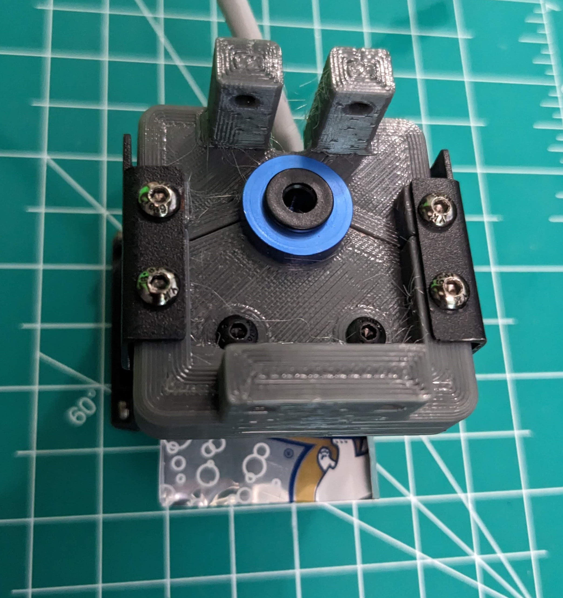

# Volcano (style) Hotend Bracket

I came across an old [YouTube from ModBot](https://www.youtube.com/watch?v=cXx1_OsDcIc) where he put an E3Dv6 on an older Two Trees coreXY.  Inspired by the mount he found, I designed one for the SP5-V3 and purchased a [cheap Volcano clone from Amazon](https://www.amazon.com/dp/B0BR7Z63H8).  Inspired by the mount he found, [I designed my own](Volcano%20Hotend%20Mount.step).

It is basically a replacement for the bracke that the stock heatsink is attached too and reuses some stock parts.

There are 4 parts to print wth the Touch Mount being optional (if you don't use a touch probe, you don't need the mount). [Front](Front.3mf) and [Back](Back.3mf) are the pieces that hold the heatsink. They are held together by the fan mounting brackets that come with the printer and further supported when installed in the carriage. The [3010 mount](3010 mount.3mf) is screwed into the bottom of the Front. It reuses the 3010 fan from the heatsink that came with the printer. You'll need a new piece of PTFE tube since it's a bit further than before.

### To assemble:

1. Remove the stock hotend, heatsink fan, and 4010 blower fan mounts from the stock carriage and the extruder.
2. Attach the 3010 mount using 2 M3x10 screws from the top.
3. Clamp the Front and Back around the neck of the Heatsink.
4. Attach the stock part cooler fan mounts using M3x6 (or M3x8). Right and left side are different - the nozzle should be lined up with the middle of the fan.
5. The assembly so far will attach to the carriage in the same location as the heatsink brack was removed reusing the M3x8 bolts, but it's a bit tricky.
    1. The 2 posts in the back will go on the outside of the carriage. To insert the screw, I passed my Allen key through the front mounting holes then passed the M3 screw in from the side with tweezers so I could screw from inside.
    2. After the back is screwed in, you can insert the M3's to fasten the front.
6. Attach the stock part cooler fans and routh the cables as you see fit.
7. Optional: Add "heat shield" above nozzle.
    1. Measure the dimensions between the fan mounts and from front to back and determine (mine was 37mm wide x 40mm deep)
    2. Cut an aluminum can to these dimention plus a little bit wider
    3. Use the extra width to bent the edges up in otder to give the shield a little more stiffness.
    4. Measure the depth of the heatsinc and cut the aluminum to allow the shield to slide between the fins and around the core of the heatsink.
    5. Slide into place low enough that the shield will be just below the heatsink fan.
8. Install the heatsink fan. If you completed optional step 7, then the bottom of the fan shuld be in contact with the surface of the heat shield.
8. Insert your new PTFE tube from the top and replace teh extruder assembly. I cut my PTFE long to start with and trimmed a bit at a time until the extruder seated correctly.
9. Optional: Install touch probe.
    1. Fasten the probe to the mounting bracket from the bottom using M3x6 screws (or however yo want to fasten it).
    2. Loosly fasten the mount to the back of Back using M3x10 screws through the elongated holes and into the bottom set of holes on the main body.
    3. Adjust the mount to the desired height and tickets the screws to hold it in place.
10. PID tune the new hotend.
```
 PID_CALIBRATE HEATER=extruder TARGET=210
```


.





